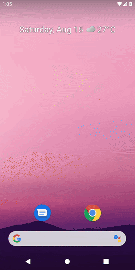
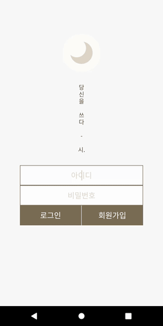
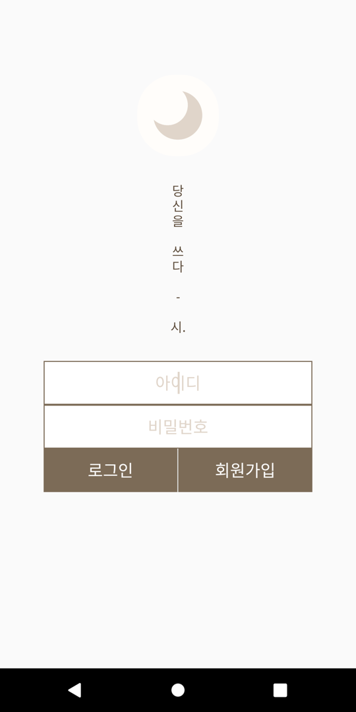
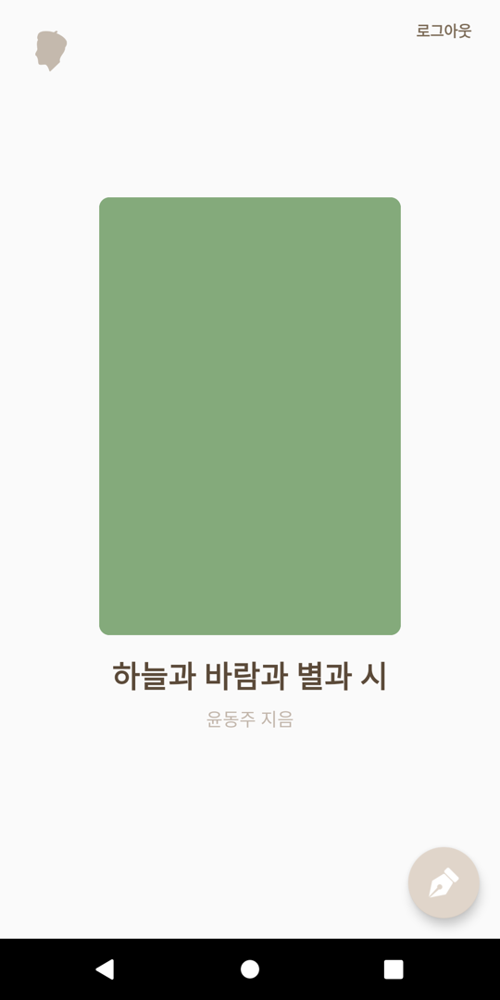
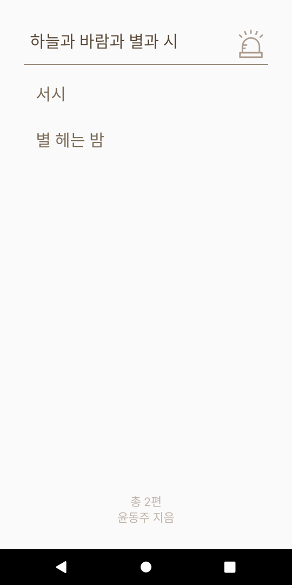
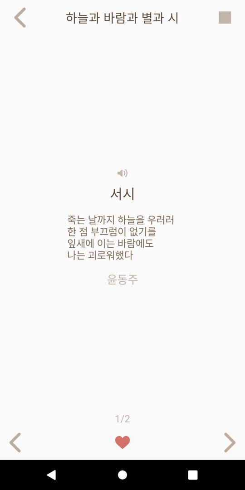
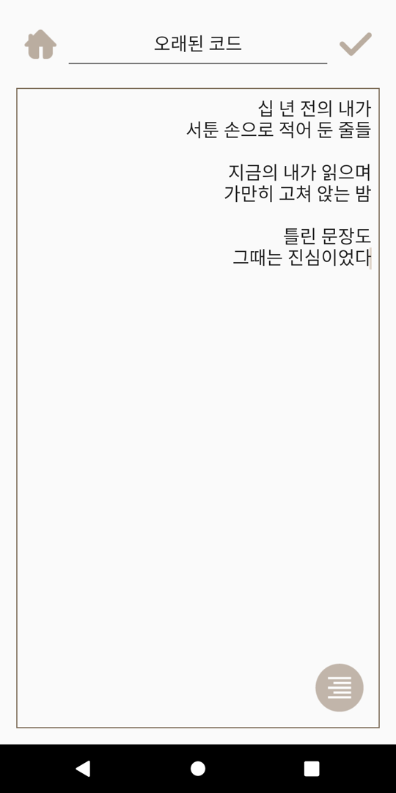
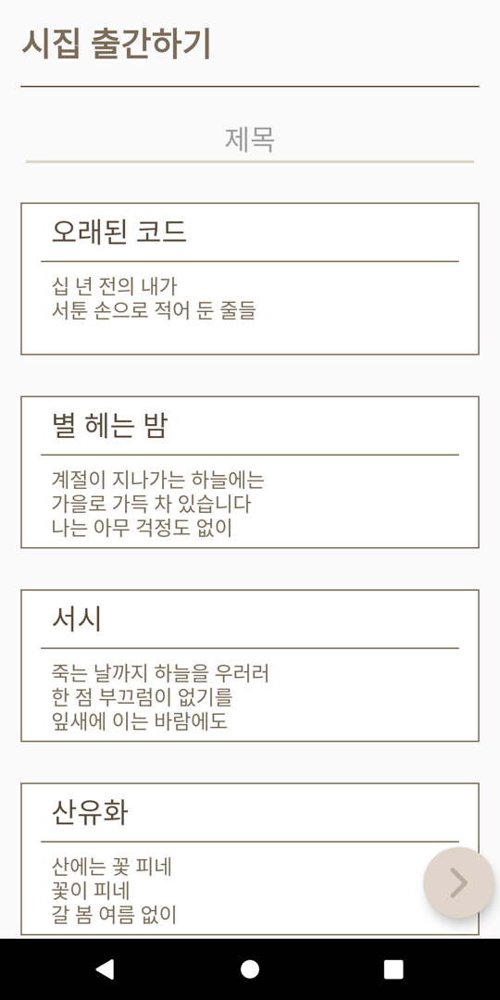
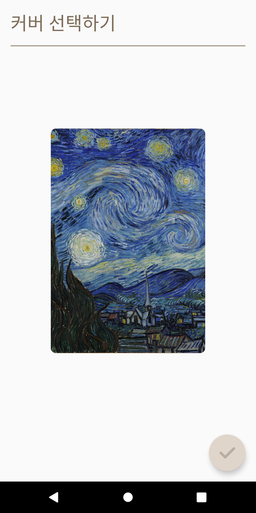
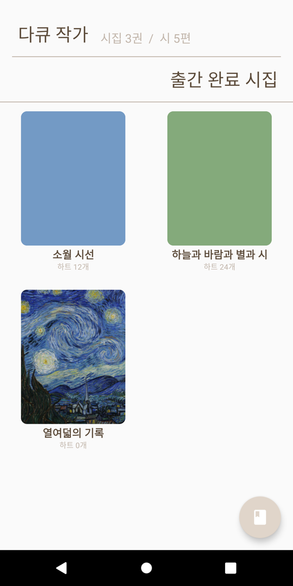

# Poem

시를 쓰고 시집으로 엮어 출간하는 안드로이드 앱 "시."예요. 다른 사람이 출간한 시집을 읽고 하트를 남길 수 있고, 내가 쓴 시를 모아 표지를 고른 시집으로 출간할 수 있어요. 블루투스로 근처 친구에게 시를 직접 건넬 수도 있어요.

## 만든 이유

학창 시절 학교 프로젝트로 친구들과 역할을 나눠 만든 제품이에요. 시를 쓰고 시집으로 엮어 나누는 서비스라는 아이디어를 두고, 디자인을 맡은 친구가 화면을 그리고 서버를 맡은 친구가 API 규격을 정했어요. 저는 안드로이드 앱을 맡아 친구들이 정한 디자인과 통신 규격에 맞춰 화면과 기능을 구현했어요. 이 리포지토리는 그중 안드로이드 앱이에요.

## 데모

### 시집 읽기

로그인한 다음 인기 시집을 열어 목차에서 시를 골라 읽고, 하트를 남기는 흐름이에요.



원본 영상은 [resource/demo-read.mp4](resource/demo-read.mp4)에서 볼 수 있어요.

### 시 쓰기와 시집 출간

시를 쓰고 저장한 다음, 시 3편을 골라 표지를 정해 시집으로 출간하는 흐름이에요. 마지막에 출간한 시집이 마이페이지에 나타나요.



원본 영상은 [resource/demo-write.mp4](resource/demo-write.mp4)에서 볼 수 있어요.

## 주요 기능

- 이메일로 회원가입하고 로그인해요.
- 인기 시집을 표지와 하트 수와 함께 둘러봐요.
- 시집 목차에서 시를 골라 한 편씩 넘겨 읽어요.
- 마음에 드는 시집에 하트를 남기고, 부적절한 시집은 신고해요.
- 제목과 본문, 정렬을 정해 시를 써요.
- 시 3편 이상을 골라 표지 이미지와 함께 시집으로 출간해요.
- 블루투스로 근처 기기에 시를 전송해요.

## 동작 방식

서버 통신은 Retrofit과 OkHttp로 처리해요. 로그인하면 서버가 `Poem-Session-Key` 헤더로 세션 키를 내려주고, 이후 요청마다 이 키를 헤더에 실어 보내요. 시집 표지는 멀티파트 업로드로 서버에 저장하고, 목록 화면에서 이미지 URL로 다시 불러와요.

블루투스 공유는 서버를 거치지 않아요. 근처 기기를 검색해 시를 직접 전송하고, 주고받은 시는 Realm 데이터베이스에 저장해요.

2017년 당시 사용하던 EC2 서버는 지금 남아 있지 않아요. 그래서 복원 과정에서는 당시 API를 재현한 목 서버를 만들어 앱을 검증하고 데모 영상을 촬영했어요. 앱은 `RetrofitClass.BASE_URL`(기본값은 에뮬레이터 기준 `http://10.0.2.2:8081`)에 지정한 서버 주소로 통신해요.

## 화면 구성

| 로그인 | 메인 | 목차 | 시 읽기 |
| --- | --- | --- | --- |
|  |  |  |  |

| 시 쓰기 | 시집 출간 | 커버 선택 | 마이페이지 |
| --- | --- | --- | --- |
|  |  |  |  |

- 로그인 화면에서 이메일로 로그인하거나 회원가입해요.
- 메인 화면에서 인기 시집을 넘겨 보고 시집을 골라 들어가요.
- 목차 화면에서 시집에 담긴 시 목록을 보고 한 편을 골라요.
- 시 읽기 화면에서 시를 넘겨 읽고 하트를 남겨요.
- 시 쓰기 화면에서 제목과 본문을 쓰고 정렬을 정해 저장해요.
- 시집 출간 화면에서 시집 제목을 정하고 담을 시를 3편 이상 골라요.
- 커버 선택 화면에서 갤러리의 이미지를 시집 표지로 정해 업로드해요.
- 마이페이지에서 내 시 원고와 출간한 시집을 확인하고, 시집 출간과 블루투스 공유를 시작해요.

## 프로젝트 구조

```
app/src/main/java/root/hash_tm/
├── Activity/     화면 (로그인, 메인, 시 읽기·쓰기, 시집 출간, 블루투스 공유 등)
├── Adapter/      목록 화면의 어댑터
├── Connect/      Retrofit API 정의
├── Fragment/     시 목록 프래그먼트
├── Model/        데이터 모델
└── Util/         공통 유틸리티
resource/         데모 영상과 화면 스크린샷
```
